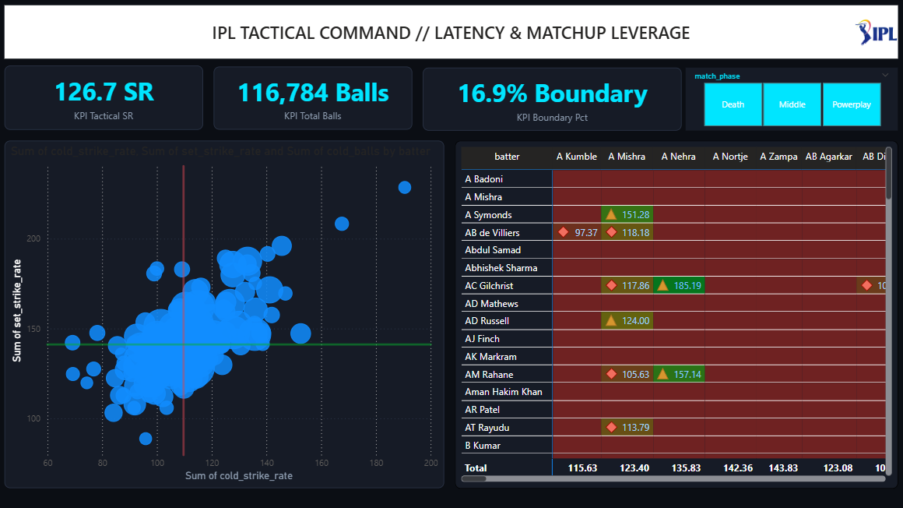

# 🏏 IPL Tactical Analysis

> A high-performance Power BI scouting telemetry deck built to quantify batter entry friction ("Startup Tax"), pitch archetype sensitivity, and phase-specific bowler matchups across the Indian Premier League.

---

## 📸 Dashboard Overview

<p align="center">
  
</p>


---

## 🎯 Analytical Premise: The "Startup Tax"

Standard T20 box scores (total runs, aggregate strike rate, batting average) frequently mask dangerous entry friction. A batter who finishes at a 145 SR might spend their first 10 balls crawling at an 85–95 SR. If that batter is dismissed inside deliveries 1–10, they inflict severe negative match leverage by consuming balls without accelerating.

This project bifurcates every innings into two critical phases:
1. **Cold Phase (Balls 1–10):** Measures startup latency and initial boundary generation.
2. **Set Phase (Balls 11+):** Measures top-gear acceleration once settled.

### Tactical Roles Cataloged:
* **🔥 ELITE ACCELERATOR:** Instant output from delivery 1 (`Cold SR ≥ 120` & `Set SR ≥ 140`).
* **⚡ PINCH HITTER / ENTRY SURGE:** High immediate friction reduction (`Cold SR ≥ 120`, lower late-innings longevity).
* **⏳ ANCHOR / BUILDER:** Slower initial ramp-up that offsets startup friction with late-innings gear shifts.
* **⚠️ HIGH STARTUP TAX:** Significant early scoring lag where $\text{Set SR} \div \text{Cold SR} \ge 1.35$ with lower cold output, introducing massive risk if dismissed early.

---

## 🧩 Key Dashboard Modules

### 1. Latency & Acceleration Quadrants (Scatter Plot)
* Plots **Cold Strike Rate** ($X$-axis) against **Set Strike Rate** ($Y$-axis).
* Dynamic median reference lines cross-section the population into 4 tactical quadrants: *Low Impact*, *Anchors*, *Accelerators*, and *Pinch Hitters*.
* Bubble sizing reflects cumulative startup volume (Balls 1–10 faced).

### 2. Phase-Specific Head-to-Head Bowler Matrix
* Micro-level strike rate matchups between individual batters and bowlers.
* Sliced dynamically by **Match Phase**: *Powerplay*, *Middle*, and *Death*.
* Conditional alert formatting isolates boundary threats and shutdown matchups.

### 3. Venue Archetype Telemetry (Surface Drift)
* Quantifies batter scoring drift across distinct ground behaviors:
  * **Spin & Grip:** Low-bounce, turning pitches.
  * **Variable / Slow:** Inconsistent bounce, gripping surfaces.
  * **True Pace & Bounce:** Flat, high-carry highway surfaces.

### 4. Zero-Dependency SVG Status Badges (DAX Vector Engine)
* Avoids broken external image URLs and web latency by drawing inline vector SVGs directly in DAX:
  ```dax
  data:image/svg+xml;utf8,<svg ...><rect .../><text ...>⚡ EXPLOSIVE</text></svg>
